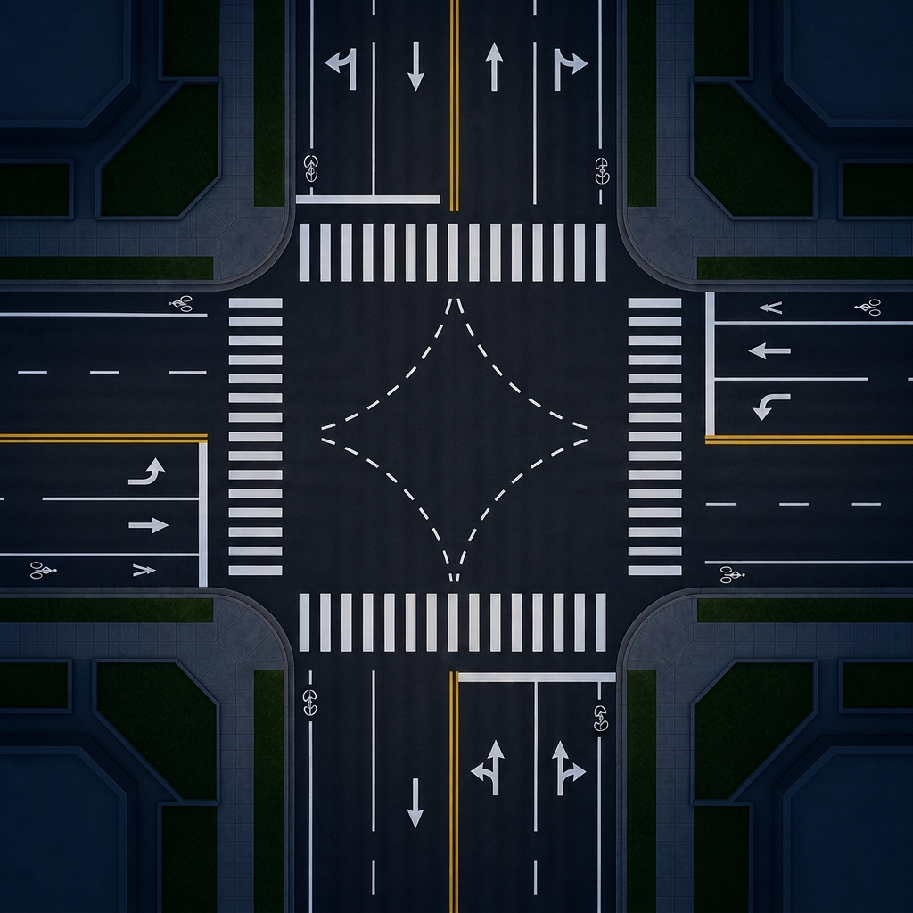

# Intelligent Traffic Management System 🚦

An AI-driven microsimulation environment designed to optimize urban traffic flow. This project replaces antiquated fixed-time traffic light cycles with a dynamic, forward-chaining inference engine that adjusts signals in real-time based on vehicle density and emergency priorities.



## ✨ Features
* **AI Inference Engine**: Uses a rule-based expert system (`rules.json`) to dynamically calculate traffic light phases based on real-time lane telemetry.
* **Emergency Vehicle Prioritization**: Automatically overrides standard traffic cycles to grant immediate green lights to ambulances and firetrucks.
* **High-Performance Canvas Rendering**: A beautiful, glassmorphism-themed web dashboard that renders vehicles, queues, and traffic signals fluidly at 60fps using the HTML5 `<canvas>` API.
* **Manual Admin Override**: Click directly on traffic lights in the dashboard to override the AI and manually orchestrate traffic flow.
* **Dynamic Physics Engine**: Vehicles calculate spatial deltas to avoid collisions, creating realistic stop-and-go waves and trailing queues.

## 🛠️ Technology Stack
* **Backend**: Python 3, Flask
* **Frontend**: HTML5, Vanilla JavaScript (Canvas API), CSS3
* **AI Architecture**: Forward-Chaining Rule/Inference Engine

## 🚀 How to Run Locally

### Prerequisites
Make sure you have Python 3 installed. You will also need `Flask` to run the backend server.

```bash
pip install flask
```

### Starting the Simulation
1. Clone this repository.
2. Navigate to the project root directory.
3. Start the backend server:

```bash
python server.py
```

4. Open your web browser and navigate to:
```
http://127.0.0.1:9090
```
*(Note: Ensure port 9090 is not being used by another application. If it is, you can change the port at the bottom of `server.py`)*

## 🎮 Dashboard Controls
* **Traffic Intensity**: Use the slider in the right panel to increase the volume of spawning vehicles.
* **Traffic Rules**: Switch between `SIGNALIZED` (AI-controlled) and other right-of-way rules.
* **Manual Override**: Toggle the Manual Override switch to ON, then click any traffic light directly on the map to instantly change its color.

---
*Architecting the future of urban mobility.*
